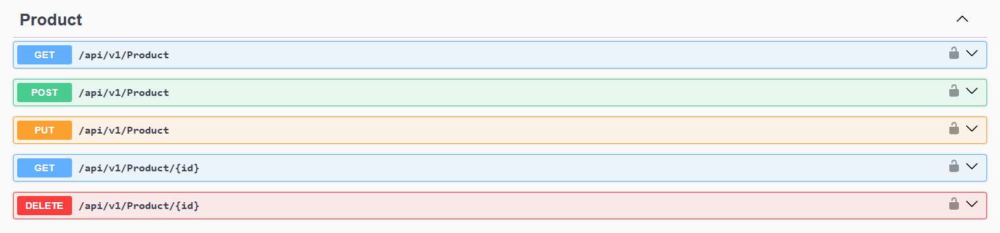
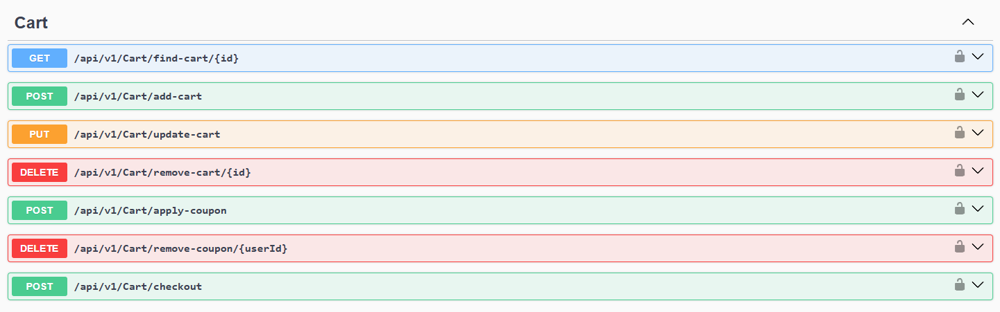
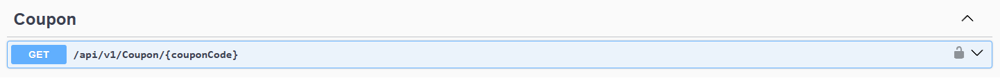

<h1>geek-shopping-microservices</h1>

GeekShopping is a **simulated e-commerce application** built with **ASP.NET Core 8**, structured in **microservices**. It features an ASP.NET Core MVC front-end, multiple independent APIs, and is integrated via an API Gateway (Ocelot). 

## 📖 About

The intention of this project was to practice and reinforce my knowledge in creating .NET applications based on a microservices architecture, with a focus on implementing best practices, including Separation of Concerns, scalability, and both synchronous and asynchronous communication between services. The project was based on the course "Microservices Architecture from 0 with ASP.NET, .NET 6, and C#" teached by Leandro Costa.

The system includes user authentication using IdentityServer, REST communication between services, and asynchronous communication via RabbitMQ. All requests to the microservices are routed through an API Gateway configured with Ocelot. It provides various APIs to handle products, shopping cart, coupons, orders, payments, and more. Although it does not process real payments or send emails, it simulates these operations to reflect real-world e-commerce scenarios.

## 📋 Prerequisites

To run the application on your local machine, you will need the following tools installed:

- [.NET SDK 8.0](https://dotnet.microsoft.com/en-us/download/dotnet/8.0)
- [SQL Server](https://www.microsoft.com/en-us/sql-server/)
- [Docker](https://www.docker.com/) (for RabbitMQ)

## ⚙️ Setup

1. Clone the repository.

2. Open the solution in Visual Studio, right-click the solution name and select **Properties**.
In the Startup Project section, choose Multiple startup projects, and set the Action to **Start** for all projects except `GeekShopping.MessageBus` and `GeekShopping.PaymentProcessor`, which can be left as **None**.

3. To start RabbitMQ, run the following command in your terminal:

    ```sh
    docker run -d --hostname my-rabbit --name some-rabbit -p 5672:5672 -p 15672:15672 rabbitmq:3-management
    ```

4. Build and run the application.

5. When the application starts, multiple Swagger tabs for the APIs will open in your browser.
You can access the main web application at: https://localhost:4430

# 📚 Project Structure

### 🌐 API Gateway  
#### `GeekShopping.APIGateway`  
Ocelot API Gateway that routes requests to the appropriate microservices.

---

### 🖥️ Front-end  
#### `GeekShopping.Web`
ASP.NET Core MVC web application that serves as the front-end interface of the system, providing interaction with the end user.

---

### 🔄 Payments  
#### `IProcessPayment` & `ProcessPayment`  
Mock implementation for payment processing. The `PaymentProcessor` method always returns `true`, simulating a successful payment.

> This component could be replaced by a real service or an external system written in another language.

---

### 🔧 Services

Below are the services that compose the GeekShopping architecture:

- ### `GeekShopping.ProductAPI`  
    Manages the product catalog. Supports:

    - Retrieve products.
    - Create new products.
    - Update products details.
    - Retrieve a specific product and its details.
    - Delete a product (admin-only).

    **Endpoints:**  

    

- ### `GeekShopping.CartAPI`  
    Manages the shopping cart. Supports:

    - Retrieve the shopping cart for a specific user.
    - Create a new shopping cart or adds a new product to an existing cart.
    - Update the product quantity if it already exists in the cart.
    - Remove products from the cart.
    - Apply and remove coupons.
    - Finalize purchases and sends checkout data to RabbitMQ for asynchronous payment processing.

    **Endpoints:**  

    

- ### `GeekShopping.CouponAPI`  
    Handles discount coupon logic. It exposes an endpoint to retrieve coupon details based on the coupon code. This microservice is integrated with the CartAPI through synchronous communication and is invoked during the checkout process to validate the applied discount.

    **Endpoints:**  

    
    
- ### `GeekShopping.OrderAPI`  
    Responsible for:
    - Creating and storing order data.
    - Updating payment status. 

    It consumes checkout messages and publishes payment request messages to RabbitMQ.

- ### `GeekShopping.PaymentAPI`  
    Processes payments via RabbitMQ and updates the order’s payment status based on the mocked `PaymentProcessor`.

- ### `GeekShopping.Email`  
    Consumes messages from the `DirectPaymentUpdateExchange` queue and stores a mock email record in the SQL Server database.

    > This service does not send real emails, it serves as a placeholder for future implementation.

- ### `GeekShopping.IdentityServer`  
    Authentication handled by **Duende IdentityServer**, using:
    - OAuth2
    - OpenID Connect
    - JWT

    > Issues and validates tokens, enabling secure access control across microservices.

## 🛠 Technologies

- [ASP.NET Core 8 MVC](https://learn.microsoft.com/en-us/aspnet/core/mvc/overview?view=aspnetcore-8.0) - Used to build the front-end application that interacts with users.
- [ASP.NET Core 8 Web APIs](https://learn.microsoft.com/en-us/aspnet/core/web-api/?view=aspnetcore-8.0) - Used to create REST APIs for each microservice.
- [Entity Framework Core](https://learn.microsoft.com/en-us/ef/core/) - ORM for mapping and managing the database.
- [Duende IdentityServer](https://duendesoftware.com/products/identityserver) - Provides authentication and authorization via OAuth2 and OpenID Connect.
- [Ocelot API Gateway](https://ocelot.readthedocs.io/en/latest/) - Handles routing between the front-end and back-end microservices.
- [RabbitMQ](https://www.rabbitmq.com/) - Message broker used for asynchronous communication between services. 
- [AutoMapper](https://automapper.org/) - Used to map data between Value Objects and domain models.
- [Docker](https://www.docker.com/) - Used to containerize and run the RabbitMQ instance locally.
- [SQL Server](https://www.microsoft.com/en-us/sql-server/) - Relational database used by the services to persist data.
- [Bootstrap](https://getbootstrap.com/) - Front-end framework used to style the MVC application for a responsive and modern UI.